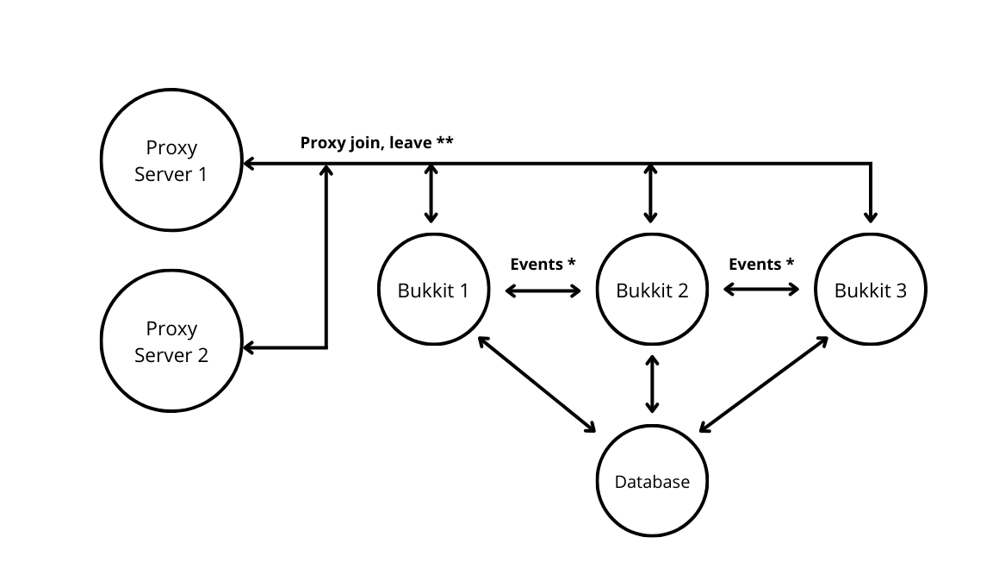

## How does proxy mode work?

## How does it work?

First of all, you have to install REDIS, which will be used to send data between the proxies and the bukkit servers. 

### Each proxy will be used to:
- Send join and leave messages to the bukkit servers, also like the join and leave notifications.
- Receive guild data from the bukkit servers, used in the Guilds Proxy API.

### Bukkit servers will:
- Update other bukkit servers when anything changes in the guild, like the Guild TAG change.
- Send guild data to the Proxy API.
- Read and write data in the SQL or MongoDB database.

### Multiple proxies
You can use multiple proxies, the plugin will handle online players and guild data automatically. 

## How to install?

You can refer to the [Installation Page](/guilds/installation/requirements) for more information about how to install the plugin.

## How to configure?

You should configure all the configuration files of the bukkit servers in the same way.

You have to recommend that:

- Database credentials
- Redis credentials

are the same in **all the servers**.

Make sure to enable **Proxy Mode** (`guilds.settings.bungeecord.enabled` in `config.yml`) in all the servers.